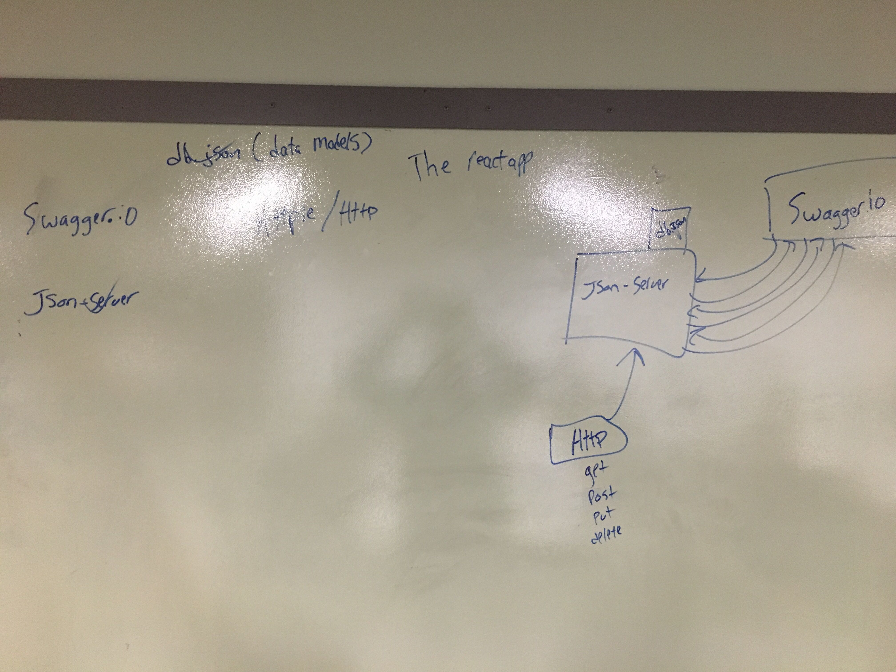

# Simple -  API

## Simple-API

### Author: Pratiibh Bassi (worked with class)

### Links and Resources
* [submission PR](https://github.com/pratiibh-401-advanced-javascript/simple-api/pull/1)

#### Documentation
* [api docs](https://app.swaggerhub.com/apis/Pratiibh/test-for-lab/0.1#/)

### Modules
#### `db.json` - holds all categories and products
#### `swagger.json` - file with categories and products
#### `.env` requirements
* `local host` - 3000

#### Running the app
* `npm start`
* Endpoint: /categories GET, POST
* Endpoint: /categories/:id/ PUT, DELETE
* Endpoint: /products GET, POST
* Endpoint: /products/:id/ PUT, DELETE
* Example inputs in CLI
* GET (get)
  * http get http://localhost:3000/categories/1
* POST (create)
  * echo '{"id": 1, "description":"value","display_name": "value", "name":"value"}' | http post :3000/categories
* PUT (update)
  * echo '{"id": 1, "description":"value","display_name": "value", "name":"value"}' | http put :3000/categories
* DELETE
  * http delete http://localhost:3000/categories/1
  
#### UML
 
